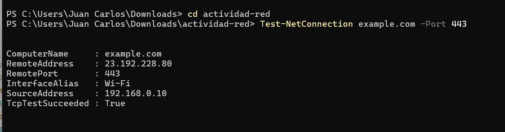

# 📱 Actividad 1 – Implementación y análisis de conexión TCP (Three Way Handshake)

## 🔹 Introducción

El protocolo **TCP (Transmission Control Protocol)** es un protocolo orientado a la conexión que garantiza la entrega confiable de datos entre dispositivos en una red.
El mecanismo fundamental para establecer dicha conexión es el **Three Way Handshake**, el cual asegura que tanto el cliente como el servidor estén sincronizados en cuanto a la numeración de secuencia y estén preparados para transmitir información.

En esta actividad se emplearon herramientas de consola (**PowerShell en Windows**) y de análisis de red (**Wireshark**) para observar el proceso de establecimiento de conexión con el servidor público `example.com` sobre el puerto **443 (HTTPS)**.

---

## 🔹 Objetivos

* Ejecutar una prueba de conexión hacia un servidor remoto mediante consola.
* Capturar y analizar el establecimiento de la conexión TCP utilizando Wireshark.
* Explicar de manera formal el funcionamiento del **Three Way Handshake**.
* Documentar la práctica con evidencias gráficas y resultados técnicos.

---

## 🔹 Metodología

### 1. Prueba de conexión desde PowerShell

Se utilizó el siguiente comando en **Windows PowerShell**:

```powershell
Test-NetConnection example.com -Port 443
```

Este comando permite verificar si es posible establecer una conexión TCP hacia un servidor en un puerto específico.
En este caso, el puerto **443** corresponde al protocolo HTTPS, que utiliza conexiones seguras mediante TLS sobre TCP.

#### Evidencia

Captura de pantalla mostrando el resultado del comando en PowerShell:



---

### 2. Captura del tráfico con Wireshark

Se abrió **Wireshark**, seleccionando la interfaz de red activa (en este caso, conexión Wi-Fi).
Se aplicó el siguiente filtro de captura para observar únicamente el tráfico relevante:

```
tcp port 443
```

Posteriormente, se ejecutó nuevamente el comando `Test-NetConnection` y se analizaron los primeros tres paquetes que corresponden al proceso de **Three Way Handshake**.

#### Evidencia

Captura de pantalla mostrando los paquetes SYN, SYN-ACK y ACK:


---

## 🔹 Análisis técnico del Three Way Handshake

El **Three Way Handshake** es el procedimiento estándar que utiliza TCP para establecer una conexión fiable entre cliente y servidor. Consta de tres fases:

1. **SYN (synchronize):**

   * El cliente envía un segmento TCP con el flag `SYN` activado.
   * Este paquete incluye un número de secuencia inicial (ISN, *Initial Sequence Number*), el cual servirá como punto de referencia para la transmisión de datos.

2. **SYN-ACK (synchronize-acknowledge):**

   * El servidor recibe la solicitud y responde con un segmento que contiene dos flags: `SYN` y `ACK`.
   * El flag `ACK` confirma la recepción del número de secuencia del cliente.
   * El flag `SYN` contiene a su vez el número de secuencia inicial del servidor.

3. **ACK (acknowledge):**

   * Finalmente, el cliente responde con un paquete que tiene el flag `ACK`.
   * Este confirma la recepción del número de secuencia inicial del servidor.
   * A partir de este momento, la conexión queda establecida y ambos extremos pueden comenzar la transferencia de datos.

### Importancia del Three Way Handshake

Este mecanismo cumple tres funciones críticas:

* Sincronizar los números de secuencia de cliente y servidor.
* Confirmar que ambos extremos están listos para comunicarse.
* Establecer un canal de comunicación fiable antes de enviar información sensible.

---

## 🔹 Caso práctico adicional

Como ejercicio complementario, se realizó una transferencia sencilla de archivos utilizando el comando `curl`:

```powershell
curl https://example.com -o ejemplo.html
```

Este comando descarga el contenido de la página `example.com` y lo guarda localmente en un archivo llamado `ejemplo.html`.
De esta manera, se valida que tras el establecimiento del handshake TCP, es posible transmitir datos de manera segura sobre la conexión.

---

## 🔹 Conclusiones

* El protocolo **TCP** utiliza el **Three Way Handshake** como mecanismo fundamental para garantizar una conexión confiable antes de transmitir datos.
* El uso del comando `Test-NetConnection` en PowerShell permitió comprobar la disponibilidad del puerto remoto y generar el tráfico necesario para el análisis.
* La herramienta **Wireshark** permitió evidenciar claramente las fases del handshake (SYN → SYN-ACK → ACK).
* Finalmente, se comprobó la transmisión de datos mediante el uso de `curl`, validando así la aplicación práctica del proceso de conexión.

---